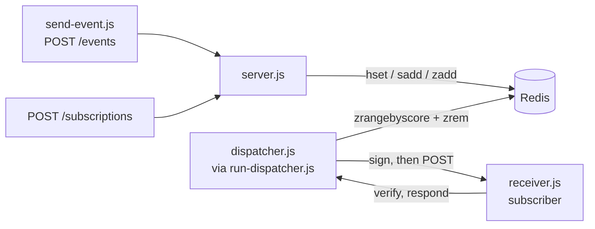

# Webhook Delivery (Redis)

HMAC-signed webhook delivery with Redis-sorted-set-based retry and backoff scheduling, no Bull/BullMQ, just `ioredis` and plain Node.

After building the Postgres-backed job queue and learning the core concepts, safe concurrent claiming, retries, backoff, from scratch with no framework, I wanted to see how the same ideas played out on a different datastore. Redis actually turned out to be the easier half of the two builds, not because the concepts were simpler, but because I'd already learned them the hard way with Postgres, so this project was mostly about learning new syntax rather than new ideas.

## Architecture



Three separate processes, on purpose, not one script doing everything:

- **`server.js`** is the ingest API. `POST /subscriptions` registers a subscriber (generates an `id` and `secret`, stores their `url`). `POST /events` fans one event out to every subscriber, creating a `delivery` record for each and queuing it. It never talks to a subscriber directly, its job ends once the delivery is queued.
- **`dispatcher.js`** (run on a loop by `run-dispatcher.js`) is a background worker, not a server. Nothing calls it, it polls Redis on its own schedule, finds deliveries that are due, signs each payload, and POSTs it to the subscriber's registered URL.
- **`receiver.js`** plays the role of a subscriber's own server. It verifies the signature on anything it receives and responds success or failure, which is what actually drives `dispatcher.js`'s retry/backoff decisions.

## Redis key design

| Key | Type | Purpose |
|---|---|---|
| `subscriber:{id}` | hash | `url`, `secret` for one registered subscriber |
| `all_subscribers` | set | every subscriber id, so `/events` knows who to fan out to |
| `delivery:{id}` | hash | `eventId`, `subscriberId`, `url`, `payload`, `attempts`, `max_attempts`, `status` |
| `retry:zset` | sorted set | member = delivery id, score = timestamp (ms) it's next due to be attempted |

## Setup

```bash
docker compose up -d --wait
npm install
cp .env.example .env
```

Registering your first subscriber and finishing `.env` is covered in the Demo section below.

## Demo

Four terminals. `.env` changes only take effect on restart, so update `SUBSCRIBER_SECRET` *before* starting `receiver.js`, not after.

```bash
# terminal 1
node server.js

# register a subscriber (Postman/curl), url: http://localhost:3001/
# paste the returned secret into .env as SUBSCRIBER_SECRET
# set FAIL_COUNT=2 in .env for the interesting retry story

# terminal 2 (start after .env is updated)
node receiver.js

# terminal 3
node run-dispatcher.js

# terminal 4
node send-event.js
```

Watch terminals 2 and 3: the delivery fails twice with a growing delay (backoff doubling each attempt), then succeeds on the third try. Set `DOWN=true` instead and it'll retry until `max_attempts` is hit and the delivery goes `dead`.

## Testing

```bash
npm test
```

The tests need a running Redis instance, `docker compose up -d --wait` provides it.

`retry.test.js` spins up a real throwaway HTTP server per test (no mocking) and proves, against the actual `dispatcher.js` functions:

- a delivery that fails a couple of times eventually reaches `status: "completed"`
- a delivery that always fails eventually reaches `status: "dead"` once `max_attempts` is hit
- `verify()` correctly rejects a signature with the wrong payload, secret, or signature
- `verify()` correctly accepts a signature that genuinely matches

## Design decisions

**Why a Redis sorted set (`retry:zset`) instead of `setTimeout` or a cron job for scheduling retries?** Durability is the main one: the schedule lives in Redis, not in process memory, so it survives a crash, a restart, or a redeploy in a way `setTimeout` timers never could. The score gives every delivery its own independent due-time, so exponential backoff per delivery falls out naturally, a single cron job checking on a fixed schedule can't do that as cleanly. It's also multi-worker safe: any number of `dispatcher.js` processes can poll the same set, and `zrem` is what claims a delivery, so two workers can't grab the same one the way two independent timers could never coordinate at all. `run-dispatcher.js` still uses a `setInterval` internally, but only to ask "is anything due right now" every couple of seconds, the actual scheduling is durable, sitting in Redis.

**Why does `dispatcher.js` look up a subscriber's secret fresh every time, instead of copying it onto the delivery record when it's created?** Drift. If the secret were copied at creation time and the original ever changed, the delivery record would keep the stale copy, and a retry later would sign with the wrong value. Referencing the original instead of copying it means there's only ever one place the secret lives, so it can't fall out of sync with itself.

**Why `crypto.timingSafeEqual` instead of `===` for comparing signatures?** `===` bails out at the first mismatched character, which leaks timing information, an attacker can brute-force one byte at a time by measuring which guess takes marginally longer to fail. `timingSafeEqual` gives no such signal, so the attacker is forced to guess the entire signature at once, which is computationally infeasible for a signature of real length.

**Why is the claim step (`zrangebyscore` then `zrem`) not fully atomic, and what would fix it?** They're two separate Redis commands, not one. I chose this while learning Redis because it's simple to read and it's correct for a single dispatcher. The tradeoff: the gap between the read and the remove isn't atomic, so with multiple dispatchers running at once, two workers could claim the same delivery and send it twice. The upgrade path is moving the read-and-remove into a single Lua script, which Redis runs atomically, closing that gap, deliberately not built here so I could get the basic commands right first.

**Why split `dispatcher.js` and `run-dispatcher.js` into two files, mirroring the `worker.js`/`run-worker.js` pattern from the sibling job-queue-service project?** Mainly to avoid side effects on import. If `signDueEntries` and the interval loop lived in the same file, importing it anywhere (like in `retry.test.js`) would start the polling loop automatically, whether you wanted it running or not. Keeping them separate means `dispatcher.js` can be imported and called as many times as needed with nothing running in the background, which makes it actually testable, and it means the runner is swappable, the same `signDueEntries` function could be driven by a scheduled AWS Lambda instead of a local interval loop without touching the core logic at all.

## Known limitations

- **No authentication on the ingest API.** Anyone who can reach `server.js` can register a subscriber or POST an event, no API key, no auth of any kind. Fine for a local demo, not something you'd ship.
- **`zrangebyscore` + `zrem` isn't atomic** (see Design decisions above), running multiple `dispatcher.js` processes concurrently could double-deliver a webhook.
- **Dead deliveries are silently terminal.** Once `status` flips to `dead`, there's no dead-letter queue, no alerting, and no endpoint to inspect how many deliveries have died or why.
- **Delivery records never expire.** `delivery:{id}` hashes accumulate in Redis forever, since Redis is RAM-backed, this would eventually become a real memory problem at scale.
- **`receiver.js` only simulates one subscriber at a time.** It verifies against a single `SUBSCRIBER_SECRET` read from its own `.env`, while `server.js` correctly generates a unique secret per subscriber and `dispatcher.js` correctly looks each one up individually. The demo receiver's single hardcoded secret is a shortcut for local testing, not a reflection of how the actual signing/verification logic works, that part is genuinely per-subscriber.